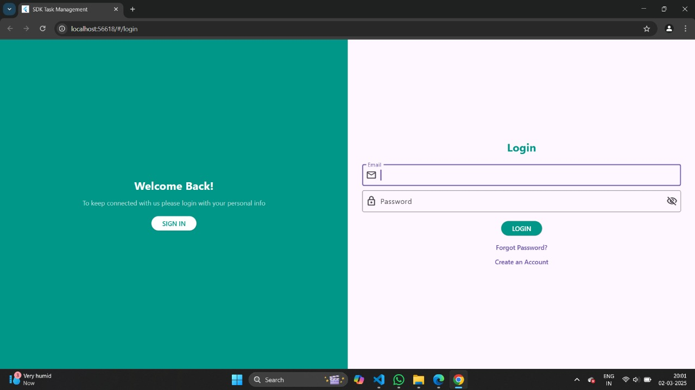
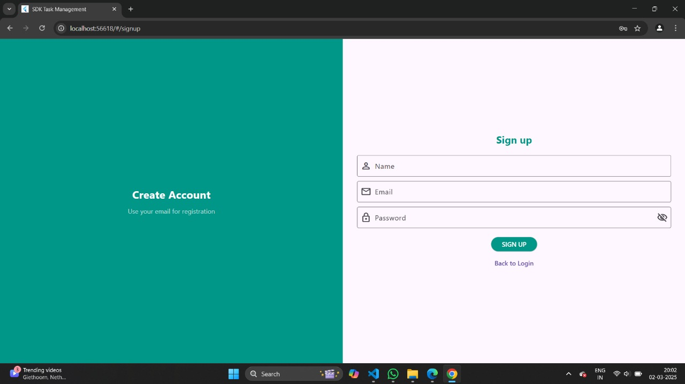
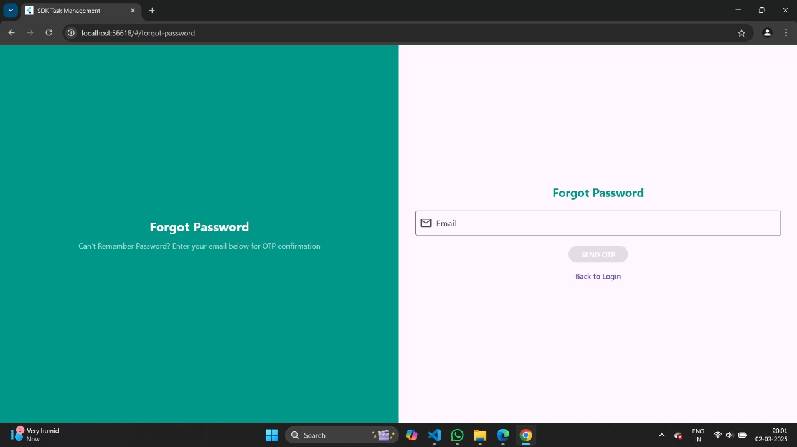
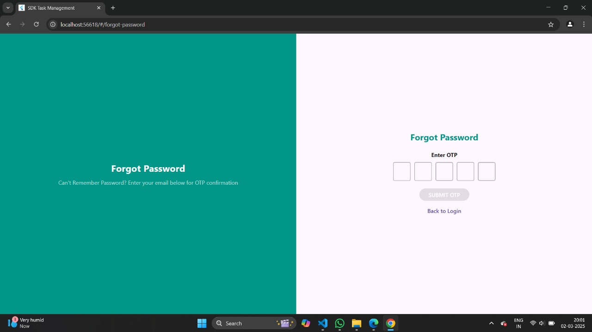
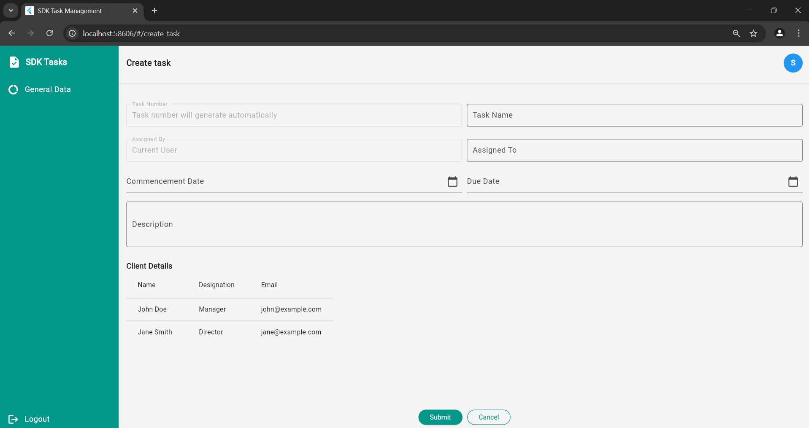
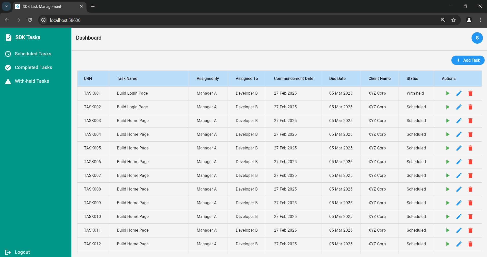
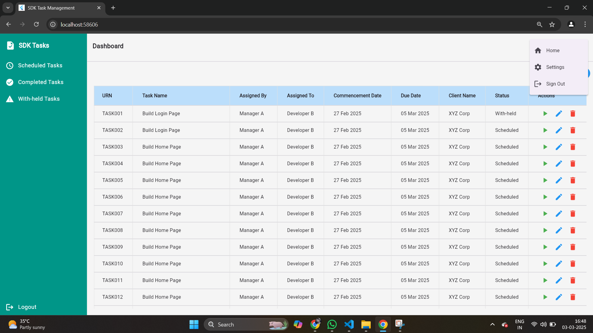

# Task Management App

A Flutter-based task management application designed to help users create, track, and manage their tasks efficiently.

## Installation & Setup
### Backend (Server)
1. Navigate to the server directory and install dependencies:
   ```bash
   npm install
   ```
2. Start the backend server:
   ```bash
   nodemon
   ```
3. Include .env file in server
   add mongo connection string and port

### Frontend (Flutter App)
1. Navigate to the Flutter project directory and install dependencies:
   ```bash
   flutter pub get
   ```
2. Run the Flutter application:
   ```bash
   flutter run
   ```

## Screenshots for completed works


 
 
 
 
 
 
 

